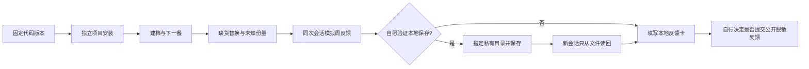

# 开发者自助试用

状态：0.3.0自助复现指南。全部使用下列虚构资料，参与者自行选择是否反馈；没有邀请名单、真实用户结果或采集后台。产品需求和当前阶段以[唯一产品规格](product-spec.md)为准。

这轮只回答三个问题：能否装起来、是否知道下一步怎么做、记录能否在新会话继续使用。不验证减脂效果、营养处方或连续一周使用。主流程预计20–30分钟，这是安排参考，实际耗时请如实记录；可选存储流程另需约10分钟。

## 开始前

受测代码固定为`0.3.0`，使用[GitHub Release](https://github.com/aiiqc/nutrition-skill/releases/tag/v0.3.0)中的完整源码ZIP与对应SHA256，或[tag源码](https://github.com/aiiqc/nutrition-skill/tree/v0.3.0)。解压到新专用文件夹，按[安装说明](installation.md#在独立项目试用)检查并复制。GitHub自动生成ZIP不沿用Release附件的校验值。

本轮优先macOS/Linux、Python 3.11+及能读取文件和执行Python的Codex项目副本；CLI 0.157.1的既有证据不保证其他版本或桌面GUI。其他宿主可以尝试，但单独填写环境，失败不靠全局安装插件或放宽权限来绕过。

只用虚构成员`pilot_adult`，无需真实姓名、体重、病历、照片、联系方式或账号信息。核心不联网，模型宿主可能处理和保留对话；不要把“虚构试用”理解为宿主零留存。默认仅本次使用，存储步骤另作明确选择。



## 逐步操作

每步只记`PASS / FAIL / BLOCKED / NOT RUN`及一句观察。`PASS`需要实际结果；资料不足时正确返回`needs_information`也可以通过对应行为检查。环境阻止执行记`BLOCKED`，自己未选的可选步骤记`NOT RUN`。

### T01 安装与计算基线

按安装页完成复制。在解压的源目录执行以下两条只读命令：

```sh
python3 -B -c 'import nutrition_core; print(nutrition_core.__version__)'
python3 -B scripts/nutrition.py --input examples/calculate.json
```

应显示`0.3.0`；第二条是180g生鸡胸的算术例子，216 kcal、40.5g蛋白质。记下OS、Python、宿主版本与可见模型名称。只安装wheel不等于安装Skill；不能执行Python时记录限制，不把模型估算当作计算基线。

### T02 建档与下一餐

在刚复制Skill的独立项目打开新会话，发送：

> 使用 $nutrition-skill。以下全部是虚构软件试用，日期语境为2026-10-06。成员ID是pilot_adult，34岁，希望慢慢减脂，偏好中式、懒人、外卖，不喜欢香菜。先仅本次使用，不保存档案。请帮我选下一顿午餐；资料不足先问我，不要替我填写健康情况。

应实际读取Skill并调用核心，保留健康缺项，不擅自生成热量目标。收到健康追问后，发送同一虚构人物的补充资料：

> 这名虚构人物自报没有食物过敏、疾病、用药、孕哺情况，也没有进食障碍或营养不良风险。主目标为减脂。继续给一个容易购买的午餐组合即可，不需要精确热量。

应得到定性结构建议；不要求每个宿主措辞或菜名完全相同。只看到介绍文字、没有实际工具结果，不能算核心调用通过。

如想单独测自然发现，在另一个全新会话去掉第一句`使用 $nutrition-skill`重试，并另记结果。不要在已经显式加载过Skill的会话中把后续使用当成自然发现证据。

### T03 缺货与未知份量

依次发送：

> 刚才首推的主菜卖完了，帮我换一个。我仍想保留主食和熟蔬菜，也仍然不喜欢香菜。

> 虚构记录：2026-10-06午餐实际吃了豆腐、米饭和熟蔬菜，份量不知道。请只记录已知情况，继续仅本次使用。

换餐应排除实际推荐过的候选并保留偏好；无合适候选时解释冲突也合理。实吃应使用未知份量粗记，不能编造克数、精确营养总量或声称已写入磁盘。

### T04 同次会话模拟周反馈

发送下面的完整虚构反馈，不需要真的等待一周：

> 继续这个软件试用，把日期语境设为2026-10-12。模拟观察了7天，5天按建议执行，整体容易执行；两天下午较饿，精神正常，没有训练，没有健康变化、食欲下降或不明原因变轻，也不是断档回来。称重3次，没有前一周基线。请整理周反馈，仍仅本次使用。

应保留7天观察、5天执行、饥饿次数和时段、无训练及无基线；解释执行方式的调整，不自动改热量、蛋白质或断食窗口。相应核心结果应为`maintain_and_simplify`。这只证明模拟周流程，不能反馈为“实际连续使用7天”。

### T05 可选：本地保存与新会话读回

愿意验证存储再执行本步。选一个源码与安装副本之外、尚不存在的专用目录；不要使用家目录本身、共享目录、现有真实健康档案或符号链接。下面的`<试用目录绝对路径>`须先替换为你选定的真实绝对路径，不能把尖括号原样发送。目录已有且权限不合适时记录错误，不自行放宽权限。

> 我选择将这份虚构档案、2026-10-06午餐粗记和刚才的周反馈保存到本地，目录是<试用目录绝对路径>，成员ID为pilot_adult。请保存一次并回读确认；不要保存原始聊天。

只有`save_record`成功并读回，才能记“已保存”。然后在同一试用项目打开没有上述聊天的新会话，只发送：

> 使用 $nutrition-skill。请从<试用目录绝对路径>读取成员pilot_adult，告诉我已保存的口味偏好、2026-10-06午餐份量状态，以及最近一次周反馈。只读取，不更新或删除记录。

应读回不喜欢香菜、份量未知、完整周反馈，且存储revision保持不变。公开反馈只填“读回是否一致”，不要附目录、record_id、完整JSON或原始聊天。未选择保存时，本步记`NOT RUN`，不影响仅本次流程的评价，但不能宣称存储旅程通过。

### T06 可选：开发者算术与锁定检查

在源目录复用现有例子，不另建数据或测试工具：

```sh
python3 -B -m nutrition_core --input examples/check-day-plan.json
python3 -B scripts/demo.py
```

第一条只对合成的100–150g蛋白约束做算术核对，返回`ok`、`plan_complete=true`及123.8324g蛋白；1033.96 kcal不是饮食推荐。第二条应显示换餐`ok`、锁定晚餐替换`conflict`、新增过敏检查`needs_information`。这证明例子能运行，不证明宿主对话会正确处理所有锁定组合；更深的旅程见[既有案例](../examples/m3/journeys.md)。

## 反馈与结束

先在本地填写[反馈卡](../.github/ISSUE_TEMPLATE/developer-pilot.md)。记录版本、环境、T01–T06状态、卡住的一步、预期与实际，以及需要额外求助的次数；没有测就保留`NOT RUN`。不用提供姓名、邮箱、健康数据或截图。退出码2可能代表预期的缺项或冲突，应结合JSON状态判断。

愿意公开反馈时，再自行到[项目Issues](https://github.com/aiiqc/nutrition-skill/issues)检查是否已有同类问题并提交一份脱敏反馈。可使用仓库的Developer pilot feedback模板，仅报告脱敏的虚构复现步骤。GitHub账号、Issue正文及提交内容可公开访问，不是匿名收集，也不能承诺撤回后没有副本。模板提醒不能自动阻止误贴资料。

不要上传成员文件、对话导出、完整日志、报告、图片、主机路径或凭据。普通故障用本指南虚构输入重现后，只摘录操作名、状态码和必要错误；不填写无法脱敏的公开报告，也不把敏感安全问题贴到公开Issue。当前没有承诺的私密收件渠道或处理时限。

停止时关闭试用项目即可，档案不会随退出自动删除。若要移除Skill或删除虚构档案，按[退出与数据管理说明](installation.md#保存更新与退出试用)分别处理；本指南不包含自动清理授权。

## 如何评估首轮结果

主流程是T01–T04；存储与进阶结果单列。至少先看实际完成了哪条路径和卡在哪里，不用测试人数或平均分冒充可靠性结论。若出现未经同意保存、明确未保存却声称成功、覆盖记录、锁定保护失效或把未知数量写成精确数值，应暂停该受影响路径并优先修复；没有证据的步骤保持未验收。

参与人数、反馈窗口、维护者响应时限和是否扩大到真实资料尚未约定。真实开发者操作虚构人物只能支持可安装性与可理解性证据，不能证明真实健康使用、临床效果或长期记录可靠性。不要把维护者的单次自测填成外部开发者反馈。

实现选择：直接使用[GitHub原生Markdown Issue模板](https://docs.github.com/en/communities/using-templates-to-encourage-useful-issues-and-pull-requests/configuring-issue-templates-for-your-repository)，反馈字段参考[Codex开源项目的复现信息要求](https://github.com/openai/codex/blob/main/docs/contributing.md)，未复制其代码或引入依赖。没有新增问卷服务、自动上传、通知或后台采集。

## T07 完整功能的无模型基线

从源码目录运行 `python3 -B scripts/product_demo.py`。这会用临时合成档案实际完成个人目标、定量三餐、换餐保护、14天目标复盘、调整后菜单、标签算术、可选策略、分段归档及新读取。它不替代上述实际宿主对话或真实用户试用；输出的食物数量和目标只是软件验收样例。
