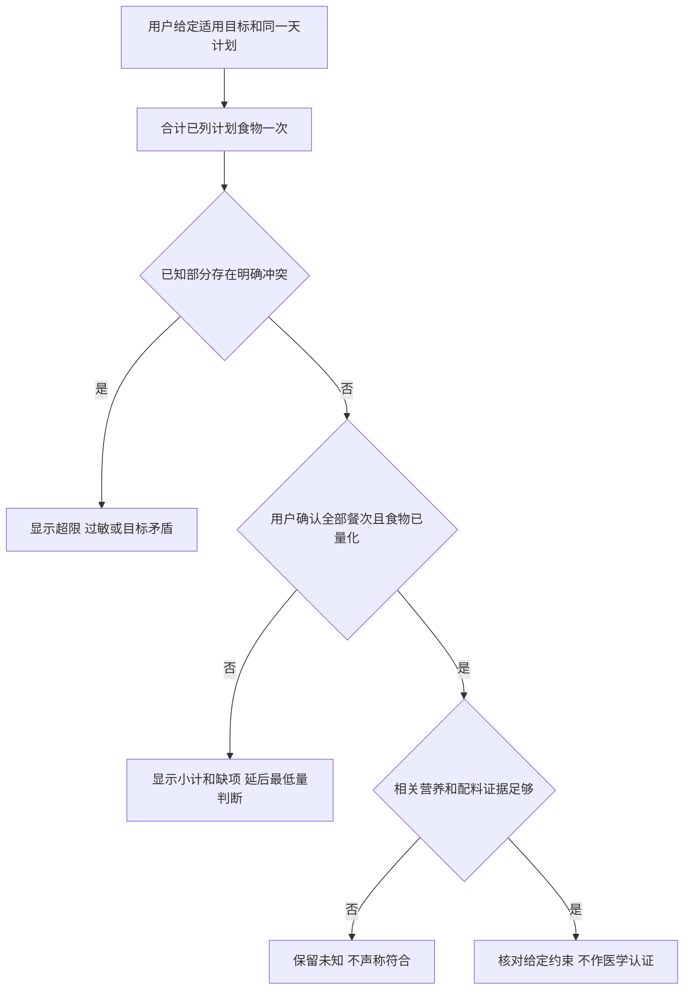
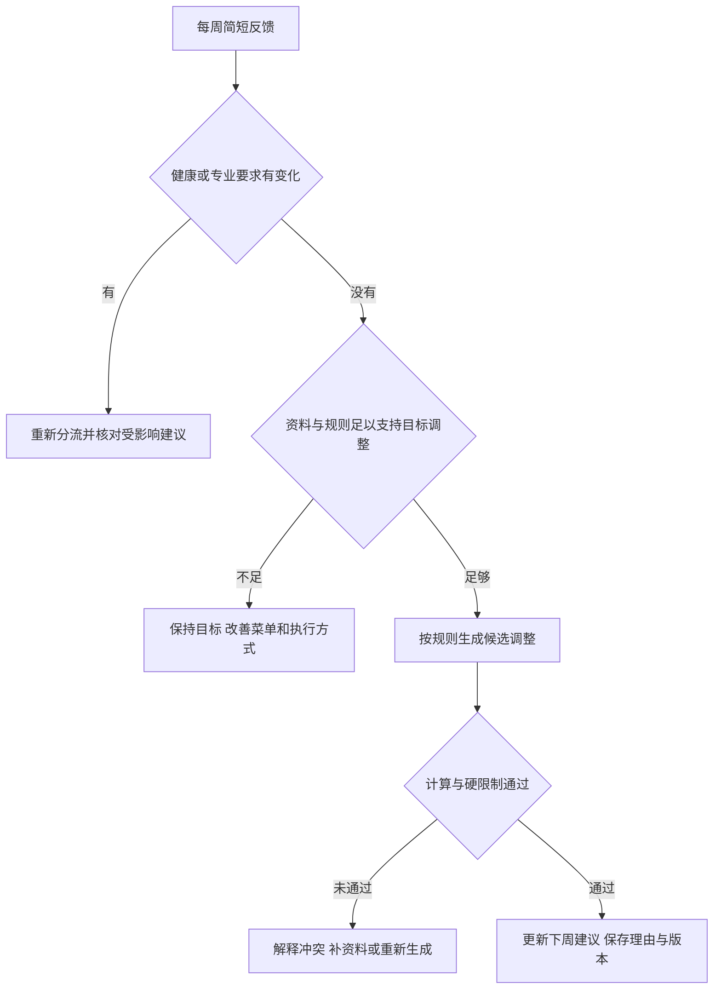
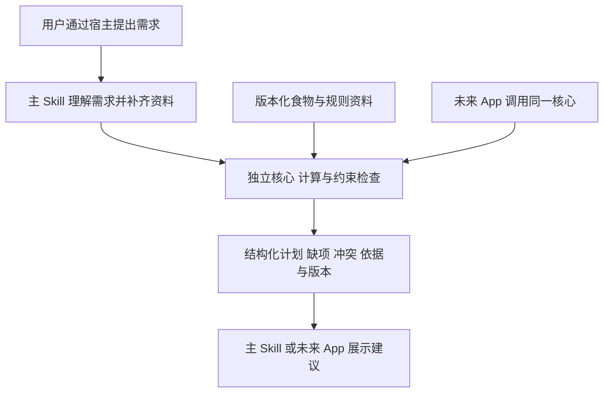

# 个性化饮食与健康 Skill 开工规格

版本：0.9 首版功能基准

整理日期：2026 年 10 月 6 日

定位：公开 GitHub 项目的产品与开发基准  
当前阶段：0.3.0首版功能整合与发布验收；原dev2为已公开历史基准

本项目帮助用户用较少的输入，得到能执行的饮食安排，并根据日常变化和每周反馈持续改善建议。首版交付是一个主 Skill、可独立调用的核心、可追溯的食物与规则资料，以及可复现的示例和验收用例。未来 App 可以复用这些能力。

本文件是规划的唯一正文。配套 HTML 只是由本文件生成的阅读版本。后续修改应更新本文件中的当前决定和待定项，而不是另建多个“最新方案”。文档版本0.9与软件版本独立；本轮软件版本为0.3.0，实际公开状态以发布记录和GitHub Release为准。

**开发状态：2026年10月6日，用户明确要求“由你这边直接到完工，然后正确地发布到GitHub上”。本轮完成已确认首版范围的功能实现、验收、提交和发布；自动目标、可执行餐单、有限周调整、食品扩充、可选策略及长期留存均纳入。开发者试用不是继续补齐核心功能的替代品。专业营养审阅、临床效果及未覆盖宿主的证据保持单独标注。**

## 已确认方向与建议的区别

以下确认来自本次对话，整理日期统一为 2026 年 10 月 5 日。文档中的实现建议不能被转述成用户已经逐项批准的决定。

| 编号 | 已确认内容 | 对实现的约束 |
|---|---|---|
| D01 | 做具有复用价值的 GitHub 开源项目，当前不做 App | 交付 Skill 与独立核心，不先建设账户、服务端或完整 App |
| D02 | 按成熟产品标准规划，规划完成后再动工 | 用户流程、失败行为、数据和验收先明确 |
| D03 | 支持个人、家庭及公开分享使用 | 个人档案分开；公共示例只用虚构资料 |
| D04 | 先做通用中餐、西餐，不绑定地区 | 菜式与数据来源地区分开；不默认某国商店或价格 |
| D05 | 一次建档，每天问怎么吃，每周简短反馈后自动调整建议 | 复用档案；普通计划调整不每次重新询问保存许可 |
| D06 | 懒人方式、不同菜式、增肌、减脂和健康饮食均纳入 | 操作难度、菜式、目标、用餐场景分别表达 |
| D07 | 纳入中医食疗与断食相关能力 | 功能保留，按证据、适用条件及限制启用 |
| D08 | 允许商业与闭源下游使用 | 自有代码采用宽松许可的方向；第三方资料单独核对 |
| D09 | 提供仅本次与本地最小档案保存方式 | 保存边界清楚；不把用户健康资料放进代码仓库 |
| D10 | 特殊人群采用分层支持 | 可以落实明确专业要求，不自动生成通用疾病处方 |
| D11 | 用三个完整虚构旅程和图形辅助审阅 | 用例成为后续功能验收基准 |
| D12 | 项目公开仓库为aiiqc/nutrition-skill | 实际远端提交、CI、tag与Release逐项核对 |
| D13 | 2026-10-06明确授权直接完成并正确发布到该仓库 | 完成本规格首版功能、必要测试、提交推送及发布；不包含邀请他人或收集真实健康资料 |

M0实现选择：工作名Nutrition Skill Core，自有代码MIT，Python 3.11+标准库与JSON契约，无第三方运行依赖；首个实际验收宿主为Codex CLI 0.157.1的app-server项目范围安装路径，已取得真实模型旅程证据；桌面GUI及其他宿主另行验证。准确输入输出见[contracts.md](contracts.md)，固定数据依据见[data-provenance.md](data-provenance.md)。这些是已授权范围内的可逆工程选择，不等同于对所有健康规则的批准。

## 用户问题与首版成功条件

用户不应为了得到下一餐建议，先学会计算热量或维护复杂表格。一次资料采集应逐步完成：先取得影响当次建议的必要信息，其余可稍后补齐。

首版成功意味着：一般用户能完成建档、取得下一餐、临时换餐、记录实际情况和周复盘；愿意精细记录的人能核对份量与计算；有专业限制的人能在已覆盖的条件内执行原有方案。开发者能在不运行聊天流程的情况下调用同一核心，并取得相同的数值和限制判断。

项目不以 Star 数、菜谱数量或一句“科学饮食”证明质量。公开价值来自可执行的用户流程、有来源的数据、明确的不确定性，以及可以重复检查的行为。

## 首版范围

| 能力 | 首版行为 | 条件与边界 |
|---|---|---|
| 渐进建档 | 收集目标、必要身体资料、限制与生活条件 | 每个计算只要求它实际需要的字段；未知不当作没有 |
| 身体与目标分析 | 汇总用户资料、估算适用指标、指出影响规划的缺项 | 不凭体重、BMI、照片或问卷诊断疾病、体脂或中医体质 |
| 下一餐与全天安排 | 默认给下一餐，需要时展开早餐、午餐、晚餐及必要加餐 | 不强迫所有人固定三餐；原有适用餐次与作息可以保留 |
| 懒人和精细记录 | 支持日常份量、文字、明确克数及包装标签 | 展示精度与输入证据相称 |
| 中式、西式、混合餐 | 按口味、时间、厨具、预算和限制选餐 | 常见组合优先；无当地价格资料时只用用户预算约束 |
| 临时换餐与聚餐 | 保留已吃和锁定内容，只调整受影响餐次 | 不以聚餐触发补偿性断食或惩罚减量 |
| 备餐与采购汇总 | 汇总选定计划中的原料和个人份量 | 明确生熟、包装量和分装依据；实际购买由用户决定 |
| 照片辅助 | 生成可修改、待确认的食物与份量候选 | 依赖宿主图像能力；不由照片确认过敏安全或专业合规 |
| 每周复盘 | 自动形成保持或调整后的下周建议 | 改善便利性与改变营养目标使用不同判断规则 |
| 家庭共餐 | 共用菜式、分别计算与记录个人份量 | 无法兼容时分开准备，不按人数直接放大个人目标 |
| 中医食疗 | 普通食材和传统做法参与选餐，展示依据层级 | 药材、辨证和治疗性声称不能由一般饮食流程自动生成 |
| 断食 | 独立选择进食时间安排，核对适用条件 | 不随减脂目标自动开启；停止条件未定义的策略不启用 |
| 专业要求落实 | 录入并确认适用专业目标，在已覆盖规则内安排餐食 | 不改变药物、治疗目标；来源含糊或缺项时暂停依赖项 |
| 档案管理 | 查看、纠正、导出、删除项目实际管理的数据 | 宿主聊天、外部备份和用户另存副本不在控制范围 |

首版不建设完整 App、账户平台、云端健康档案服务或通用插件框架。餐厅品牌库、设备自动同步和主动通知不是完成上述流程的前置条件。通知只有宿主支持且用户选择后才能承诺；没有后台能力时，周复盘由用户发起。

“懒人／精细”是输入与展示深度，“专业支持”是适用规则路径，两者不是互斥模式。切换展示深度不能清除原有过敏或专业要求。

## 使用流程与输出标准

### 初次建档

先明确当前使用对象与目标，再询问会影响本次建议的限制，包括已知过敏、相关疾病与用药、专业饮食要求，以及适用的孕哺或进食障碍相关情况。资料由用户自报，不显示为“医学筛查通过”。

减脂或增肌计算按所选规则取得年龄、身高、体重、活动与训练资料；维持健康饮食不强制设置体重目标。体脂、腰围、照片等不是所有流程的必填项。公式需要的生理参数不能从姓名或照片推断；不提供时说明哪些计算无法完成。

目标可以并存，但需记录本阶段优先顺序。不能同时承诺短期快速增肌和快速减脂。首轮询问集中在一至三个高价值问题，避免用长问卷阻止用户开始。

首次保存由用户选择仅本次或本地最小档案。持久保存开启后，确认过的结构化资料按既定范围更新，不为每条普通记录重复索取许可。新增保存种类、外部传输对象或用途时另行说明。

### 每天怎么吃

下一餐默认只展示一份推荐和两个可用替换方向，并说明食物、份量、购买或准备方式。需要时展开全天安排、营养估算、计算来源及不确定性。不能为了凑齐两个替换选项，提供尚不满足硬限制的候选。

建议优先匹配用户现有食物和当天条件。预算不足、食材缺货或没有厨具时，说明哪项软条件可调整。过敏和适用专业限制不能被预算、口味或“懒人模式”覆盖。

用户明确要求换餐时，直接在当前约束内更新对应的未来餐次；已经吃过的记录保持不变。计划中的替换不自动写入实吃日志。

### 当前可执行的目标、餐单与全天核对

0.3.0通过`automatic_targets`生成适用一般成人的估算目标，`generate_day_plan`按中西餐、厨具、份量分配及食材条件生成候选，舍入后调用全天核对。固定餐和实吃受到保护；单餐替换只改指定未来餐次，失败保持原状态。配方不明的外卖保留定性建议，包装标签使用确认后的独立算术。详见[定量餐单](meal-planning.md)。

原有`check_day_plan`继续落实明确目标的核对部分：调用者传入适用的全天约束、同一成员同一天的计划，以及用户确认的完整用餐范围。全部计划食物相加一次；不把每日最低值要求套到每一餐。早餐、午餐、晚餐齐全不等于全部食物已列入，加餐、饮料、用油和目录外食物仍须明确处理。

覆盖不足时只称已列食物的小计，最低量判断延后；已证明的超上限、过敏或限制本身矛盾仍显示冲突。完整覆盖与营养资料完整分开表示；来源文字不能证明专业认可。这个低层核对接口本身不生成菜单份量、不计算个人目标、不改实吃或档案，也不证明健康适用性；新目标与餐单功能使用独立接口。换餐或恢复后必须再次核对全天。准确字段见[contracts.md](contracts.md)。



### 记录实际情况

| 状态 | 含义 | 汇总处理 |
|---|---|---|
| 计划 | 拟安排的食物与份量 | 不计入已吃 |
| 已确认食用 | 用户确认食物及实际数量 | 按确认值汇总 |
| 部分食用或有调整 | 吃了一部分，或实际食物不同 | 保存实际数量或比例，并保留估算状态 |
| 明确未食用 | 用户明确表示没吃该项目 | 该项目实际为零 |
| 未记录或份量未知 | 尚无足够信息 | 保留未知，不填零，不宣称全天汇总完整 |

锁定是计划项目的属性，不与实吃状态混成一个字段。用户可锁定固定早餐，但新增健康限制会触发重新校验；失效的锁定餐不能继续标为可用。

“照计划吃了”“吃了刚才那餐的一半”等指向明确的用户陈述本身即可构成确认，一次输入完成记录。照片、包装识别或存在匹配歧义的文字先形成待确认候选；只有识别、单位、数量或配料歧义影响结论时才补问。照片不能识别的油、酱汁和交叉接触保留未知。记录保留用餐日期、时间依据和纠正关系。

### 每周复盘与回归

复盘先问是否容易执行、饥饿与精神状态、训练情况和重要健康变化，再结合可比的记录判断。体重资料不足时不能宣称停滞或推算精确代谢。活动估计已覆盖的消耗不能再次全量叠加设备运动热量。

每次复盘输出三种结果之一：保持营养目标并改善菜单；在适用且已审阅的范围内自动形成调整建议；暂停受影响的调整并明确所需资料或专业确认。每周复盘是已选使用节奏，不意味着每七天必须改变热量。

用户离开一段时间再回来时，先确认关键变化，从下一餐恢复，不要求补齐过去所有记录。恢复上一版计划不改写历史实吃记录，并且必须按当前限制重新检查。



## 三个验收基准旅程

以下均为虚构人物和交互样例。示意餐食不是已核算完整的个人营养方案；正式份量须由适用规则与已核对数据生成。

| 旅程 | 输入与生活条件 | 每日输出 | 临时变化 | 周复盘预期 |
|---|---|---|---|---|
| 忙碌上班族 | 34岁，175厘米、84公斤，久坐，中式外食，不称食物；无自报的已知限制，没有强制期限 | 下一餐使用有依据的日常份量；可展开早餐豆浆鸡蛋馒头、午餐鸡腿饭、晚餐鱼饭菜等组合 | 鸡腿缺货，只换午餐；晚上聚餐，改为聚餐选择与粗记录，其他餐照常 | 缺少基线且午后饥饿时保持总目标，先改善相关餐食、间隔或加餐分配 |
| 规律力量训练者 | 29岁，178厘米、74公斤，每周四次力量训练，愿意称重；酸奶燕麦早餐固定，周日可备餐 | 显示生熟状态、克数、标签与营养估算；早餐锁定，午晚餐可调整 | 三文鱼缺货，核对替换后的整餐差异；一次休息日不自动大幅减餐 | 午餐吃不完而晚餐饿，可调整分配；只有资料和规则支持时才改变总量 |
| 有专业限制的家庭成员 | 58岁，有慢性肾病，由已获同意的家属协助；最初只有“清淡”要求 | 先整理资料和待确认项；获得当前专业餐单后录入来源、份量、替换表和复查条件 | 已允许的鱼、米饭、蔬菜可以共用备菜，个人分装；配料、含钾盐或新替换不清楚时不放行 | 食欲下降、体重变轻和漏记不能当成减脂成功；整理信息供照护团队评估，不改专业目标 |

家庭实际记录逐人确认。一人吃了一份，不自动记入全家。混合菜须有可用的分配依据；若某人的限制要求无法通过共用菜式满足，明确拆分餐食。

### 旅程一的完整交互

1. **输入。**用户说：“我34岁，175厘米、84公斤，平常久坐，想慢慢减脂。主要吃中式外卖，不称食物，早餐最多五分钟。”
2. **必要追问与回答。**Skill集中确认已知过敏、疾病与用药、专业限制及进食障碍相关情况，并问是否有强制期限和预算忌口。虚构回答：“没有上述已知情况，不吃香菜，预算普通，不要求快速达标。”选择本地最小档案保存。限制仍标为用户自报，不宣称医学安全认证。
3. **首日输出。**默认显示下一餐，展开可见早餐豆浆、鸡蛋、全麦馒头，午餐鸡腿饭配蔬菜、酱汁另放，晚餐米饭、清蒸鱼、蔬菜的示意组合。份量取自适用计划与份量卡；若碗型未确定，说明估算范围，不填伪精确热量。早餐实际吃过后，用户说“早餐照计划吃了”，直接记为已确认。
4. **缺货。**用户说“没有鸡腿了”。只提供适用的鱼肉饭或豆腐配蛋饭替换；用户选择后更新午餐计划，不改早餐。饭后说“吃了刚才那份豆腐配蛋饭，饭剩约三分之一”，记录午餐实际调整与估算精度，不再次要求确认同一句清楚陈述。
5. **聚餐。**用户说“晚上临时吃火锅”。晚餐改为按类别选择食物与主食的聚餐建议，不要求提前饿肚子。餐后用户说“吃了火锅，份量记不清”，保存已知品种与份量未知；饮料未提到则未知。原晚餐保留为计划历史。
6. **第一周反馈。**用户说“有五天容易执行，两天下午很饿，只称了三次体重，没有前一周记录”。先了解午餐与间隔，保持总目标，改善相关餐食或加餐分配。不得宣称已验证减脂效果或因为缺少记录继续削减摄入。
7. **预期结束状态。**档案已保存；早餐确认、午餐调整、晚餐粗记录、未提项目未知；下周建议解释变化与缺项。核心验收对应A01、A04、A08、A09、A12、A13、A19。

### 旅程二的完整交互

1. **输入。**用户说：“我29岁，178厘米、74公斤，每周四次力量训练，想稳一点增肌。愿意称重，周日能备餐，早餐酸奶燕麦不想换。”
2. **必要追问与回答。**确认相关健康限制、最近体重和训练记录、厨房条件及当前目标。虚构回答：“无上述已知限制，只有两次体重记录，有冰箱、微波炉和平底锅。”用户开启本地最小档案；对具体计算仍缺的字段按规则补齐，不从外表猜测。
3. **首日输出。**格式示意为：固定早餐原味希腊酸奶250克、燕麦干重60克、香蕉可食部分100克；午餐鸡胸肉生重180克、米干重90克、蔬菜生重250克、用油10克；晚餐三文鱼生重180克、土豆生重300克、蔬菜生重250克并单列用油。以上数字只用于呈现格式和生熟核对，不是已经满足其增肌需求的定量处方。正式候选餐必须核对全天目标与总量后才可标为有效方案。
4. **备餐与变化。**备餐卡说明每盒对应原料份量及实际分装依据。用户说“没有三文鱼，只有鸡胸肉，今天也不训练了”。Skill分别处理缺货与单次活动变化：早餐午餐不变，晚餐重新核对营养差异后替换；不直接按相同克数换名，也不自动删除主食。
5. **实吃。**用户说“午餐米饭吃了八成，晚餐按新方案吃了”。午餐记录实际估计比例，晚餐确认；早餐若尚未确认仍保持未记录。已发生的饮食不因计划重算而改变。
6. **周反馈。**本周体重仍零散、训练与食欲正常时保持总目标。后续用户说“午餐太多吃不完，晚餐容易饿”，优先重新分配食物，保留固定早餐。是否增加全天摄入单独依据已审阅规则，不能只因目标叫增肌就每周加量。
7. **预期结束状态。**锁定早餐保留；替换有依据和版本；实吃与计划分离；粗略比例没有被伪装成称重结果；周调整解释未改总目标的原因。对应A03至A09、A12至A14、A20。

### 旅程三的完整交互

1. **输入。**已获成员同意的家属说：“我爸58岁，有慢性肾病，想让全家一起吃得清淡些。”先明确当前对象是父亲，不把家属的档案当成父亲。
2. **信息不足。**Skill请求当前适用的医生或营养师餐单、明确饮食限制与过敏信息，说明“清淡”不足以确定蛋白质、钾或饮水安排。此时可登记厨具、预算、口味及已有饮食，保存为待补专业方案，不套普通减脂公式。
3. **补充与确认。**家属提供含日期、个人份量、允许替换项、烹调要求和复查安排的专业餐单，并说父亲花生过敏。Skill让用户确认识别出的结构化要求；模糊处保留待核对。原始报告不额外保存。状态为已录入用户提供的专业方案，不是医学审核通过。
4. **共同晚餐。**假设虚构专业餐单明确列有某种做法的清蒸鱼、米饭、西葫芦及个人份量。Skill沿用原餐单的具体份量与做法，合并备菜、分别分装。其他家人使用各自计划；全家采购量按各人的原料需求相加。该旅程不编写可照用的肾病营养限值；数值验收另使用清楚标记的合成约束测试传递与冲突处理。
5. **冲突与实吃。**家属想改用另一种菜或低钠盐时，先核对专业替换表、含钾情况及过敏相关信息，不明确则保留原允许食物或分开准备。家属说“父亲晚饭吃了一半”，只更新父亲实际记录，不把其他成员自动标为已吃。
6. **周反馈。**家属说“周三没记，周五外食，最近吃得少、体重轻了些”。Skill保留缺失，汇总食欲、饮食和体重变化供照护团队评估，不判断减脂成功、不下调专业目标。已允许范围内可以改善准备方式；身体变化需要的专业处理不由普通优化代替。
7. **预期结束状态。**个人档案不串用；专业目标有来源及确认状态；共餐可解释分装；未知项没有被当成安全或零摄入；反馈可导出但不自动发给他人。对应A01、A08、A10、A11、A15、A16、A19、A20。

## 健康分流与数值规则

一般成人可以使用适用的健康饮食与目标规划。高血压、血脂等健康需求可落实有依据的一般饮食方向，治疗相关参数仍需适用依据。糖尿病相关用药、肾病、孕哺等情况进入专业要求支持路径。未成年、营养不良或进食障碍风险等情况不能套用普通成人自动减脂与断食优化。

多种情况并存时组合限制，不用一种饮食模式覆盖另一项禁忌。出现急性危险信号时，优先提示及时求助，不继续普通菜单优化。具体识别与退出规则要有适用依据。

当前可执行规则与来源在[nutrition-rules.md](nutrition-rules.md)维护，策略细节见[strategies.md](strategies.md)。以下均区分来源结论与产品取舍：

| 规则 | 本版实现 | 依据与限制 |
|---|---|---|
| R01–R02 能量初估 | 采用NASEM 2023一般成人EER，分别使用公式参数和自报活动类别 | 直接估算维护能量，不拼接Mifflin REE与FAO BMR系数；不会预测精确代谢 |
| R03 减脂 | 适用人群初始偏移-10%，不统一减500kcal | 产品默认；明确支持范围和退出条件，不作为医学安全底线 |
| R04 增肌 | 需有阻力训练，初始+5% | 产品默认，研究不证明对所有人最优 |
| R05 蛋白 | 一般成人参考当前DGA，阻力训练参考ISSN，以当前目标周期体重计算 | 适用人群、范围及蛋白能量比例均核对；不外推到疾病处方 |
| R06 餐次 | 默认三餐，可2–4餐并改分配，17个定量组合 | 克数舍入后重算；28%脂肪构成是组合求解偏好，不是额外临床目标 |
| R07 断食 | 独立明确选择12:12/14:10/16:8，核对睡眠、营养和停止条件 | 不因减脂自动开启；夜班跨午夜有日期偏移；不适停止且不自动重启 |
| R08 自动复盘 | 每周可反馈；定量调整需连续14天、各周至少3次可比称量、至少12天执行等条件 | 最多2.5个百分点且不超过150kcal，每次有理由/版本；全部阈值是产品默认 |
| R09 专业目标 | 保留成员、来源和有效期，转述已确认要求，明确数值可单独核对 | 不新增治疗参数或改变药物，不把已录入当作医学审核 |
| R10 传统做法 | 燕麦粥、水煮蔬菜、蒸热熟食，附目录ID与方法 | 普通饮食文化信息；不辨体质、开药材或承诺治疗 |

专业营养审阅与临床效果仍未运行；不以代码测试替代。未知、超出产品支持范围或冲突时，保留适用的一般帮助并说明缺项。

## 食物资料与数据边界

### 来源选择

| 来源 | 用途 | 使用与分发要求 |
|---|---|---|
| USDA FoodData Central | 基础食材、营养和部分份量；保留Foundation、SR Legacy、FNDDS、Branded等来源类型 | 数据为CC0；保留出处、版本和计算口径；API访问依赖与数据许可分开处理 [S9] |
| 台湾FDA食品营养成分资料集 | 中文名称、别名、部分常见中文食材 | 按政府资料开放授权保留出处；数据来源地区不等于产品使用地区 [S10] |
| Open Food Facts | 包装食品与条码查询 | 数据库ODbL、个别内容DBCL、图片CC BY-SA分别处理；先作为独立来源，不与自有MIT代码混称同一许可 [S11] |
| 项目自有餐食模板与日常份量说明 | 通用中西餐、懒人组合、原料分配及替换条件 | 自编内容注明所用基础数据和适用范围；不得复制未获许可的图书、菜单或图片 |

Open Food Facts 的实际合并、缓存和分发方式决定具体义务，不能简单断言“用了API就没有许可义务”或“整个下游App必须开源”。其他来源也不能仅凭公开可读就纳入可分发包。

实现建议：基础演示自带许可明确、经过核对的小型样本资料，避免用户必须先申请数据API密钥才能完成第一次体验。联网查食品作为明确配置后的可选能力，说明请求会发往哪个来源；这不意味着模型宿主离线运行或免费使用。

### 规范化原则

食物条目保留来源ID、名称与别名、品牌或原料、处理和生熟状态、可食部分说明、每100克或每份基准、营养素ID、单位、原始值与来源状态、份量依据、来源版本和许可。

数据状态分别表达实测、推算、标签值、标签舍入、来源假定零、未提供及检测下限。检测下限同时保留单样本与汇总层次，不能把带LOQ字段的汇总结果机械改写成某一个样本的“小于某值”。

不同能量计算方法分别保存。显示与求和前，按数据类型和明确版本规则选用一个方法；不得相加，也不得用统一4/9/4重算结果直接判定原数据错误。当前映射见[data-provenance.md](data-provenance.md)及P02边界。

一碗、一杯、一盒必须绑定具体说明。来源的cup、container、RACC不能自动改名为中国饭碗、任意酸奶杯或推荐摄入量。质量与体积转换需要密度或可靠包装依据；每100克不能当作每100毫升。

自做菜按原料、油盐、烹调过程和成品份数建模。存在损耗、沥水或营养保留差异时说明计算条件；不把所有营养素都视为烹调前后完全保留。同名外食只表示候选匹配，不能直接套一个精确营养值。

### 本次真实样本证据

截至2026年10月5日，已实际读取并核对11个食品样本。此结果只证明所列样本与字段，不证明整库、全部菜式或健康效果。

| 来源 | 已读取的记录 | 关键发现 |
|---|---|---|
| USDA 5个 | 171077生鸡胸、171477烤熟鸡胸、2512381生白米、169757无盐熟白米、330137原味脱脂希腊酸奶 | 生米存在2047与2048两种能量且没有1008；酸奶无1079纤维条目；鸡胸部分零值标为Assumed zero；生米有LOQ信息 |
| 台湾FDA 5个 | K0100101白壳鸡蛋、R4701201嫩豆腐、A0500205生粳米、A0550601白饭、H1150201无糖豆浆 | 五者宏量、钠钾磷有实值；豆腐和白饭单位重为0；其余正单位重量未附足够的颗、碗、杯标签；热量与修正热量并存 |
| Open Food Facts 1个 | 3017624010701 Nutella，使用官方教程条码作字段检查 | 每100克539kcal、蛋白6.3g、钠0.043g；缺少钾、磷及每份重量，不作为健康食物推荐 |

可复查示例：USDA的180克生鸡胸按所读记录为216kcal，180克烤熟鸡胸为297kcal；这不是同批食物的生熟配对，不能推出固定换算率。Open Food Facts样本的0.043克钠应换成43毫克，不能直接当作0.043毫克。

中文样本从官方CSV压缩资源在内存读取：压缩3,128,644字节，解压66,523,804字节，共230,152条营养分析行，食物与分析行不是同一计数单位。未落盘保留整库。快照SHA-256为`9aeb0cdbefad3f82be9b4089f044c8d0bc087a6b7453ba96832d126ff6ea3aa1`，仅标识本次读取内容，不替代官方版本。复查使用整合编号与分析项，不依赖更新后会变化的行号。

## 核心契约与可复用结构

核心不绑定模型、聊天历史、界面、账户或存储提供方。Skill可以把口语变成候选结构，但候选输入本身仍需校验。未来App直接调用同一核心，并负责自己的用户身份、权限、交互和持久化。



| 数据对象 | 最小内容与不变量 |
|---|---|
| 档案 Profile | 独立对象ID、当前目标、必要身体资料及测量时间、限制、偏好、生活条件、确认状态；不需要真实姓名或证件 |
| 专业要求 Constraints | 来源、日期、适用对象、单位、原文目标与有效条件；多个条件冲突时显式报告 |
| 食物与配方 Food Recipe | 来源记录、处理状态、营养状态、能量方法、单位、配方和份量依据；未知不可补零 |
| 计划 MealPlan | 餐次与用餐日期、食物份量、锁定属性、适用条件、来源与规则版本；不表示已吃 |
| 实际记录 IntakeLog | 用户确认的食物、数量或比例、未知项、原始表达、时间及更正关系；与计划独立 |
| 周反馈 Review | 执行、饥饿、精神、训练、重要变化、可比测量、日志覆盖与缺失原因 |
| 调整 Adjustment | 保持或改变、影响餐次、前后值、依据、数据截止时间、规则版本、原因与恢复关系 |

核心操作应覆盖输入校验、份量计算、营养汇总、候选餐验证、指定餐替换、周反馈评估及旧计划重新验证。对同一规范化输入、资料版本和规则版本，数值及限制判断应一致；自然语言候选菜单不要求逐字相同。

返回结果必须能区分可展示方案、资料不足、限制冲突和当前不支持，并给出具体原因、缺项与可继续的动作。计算依赖失败时，不能让语言模型补造已验证数值。

当前源码采用Python包nutrition_core承载计算、工作流和数据职责，以python -m nutrition_core及scripts/nutrition.py提供薄入口。M3已加入主Skill与按需参考，实际目录如下：

```text
SKILL.md                 主入口与交互步骤
nutrition_core/          计算、工作流、存储与稳定输入输出契约
scripts/                 宿主执行核心的薄入口
nutrition_core/data/     30条核验食品、17个定量组合、13个定性模板及来源快照
agents/openai.yaml       Codex界面元数据
references/              健康分流、证据与中医食疗说明
examples/                三个虚构旅程及结构化输入输出
tests/                   数值、状态、限制与行为用例
docs/product-spec.md     本规格唯一正文
README.md                使用、能力范围和接入说明
LICENSE                  自有代码许可
THIRD-PARTY-NOTICES.md    第三方代码与数据义务
```

主Skill按Agent Skills规范组织，详细证据与资料按需加载，不把全部数据库和医学说明塞进主文件。[S12] 技术实现优先少依赖、可独立运行；语言、运行时和分发方式须在实际仓库基准确定后写明。不能把核心函数可复用等同于浏览器或手机可以直接运行任意语言实现。

已查的现成项目可以作为流程与代码复用候选：Lzheng-fitness的营养流程、H1an1/health-coach的中文饮食表达、WellAlly-health的健康资料组织。[S13] 不以Star数证明医学质量；复制代码前检查具体文件与依赖。Lzheng-fitness的第三方声明含非商业授权内容，不可因仓库自有代码为MIT就一并纳入本项目商业复用核心。

## 保存与宿主能力

默认不额外保存原始照片、完整聊天和原始医疗报告；只保留用户确认的最小结构化资料、必要计划版本和调整依据。个人数据放在用户选择的本地数据目录，与代码仓库分离；不得自动纳入提交、演示或公共资料包。

具体保存路径在启用持久档案时显示，身份与成员归属明确，普通更新使用同一档案。写入失败时保留未保存状态，不显示成功。仅本次模式不创建项目持久档案，但宿主可能仍保存聊天；本地保存也不等于数据从未传给模型提供方。

导出应包含单位、来源、未知状态、计划与实吃区别及版本关系。删除在明确对象和范围后进行，覆盖项目控制的该成员档案及相应版本；失败项如实报告。不得暗示已删除宿主聊天、外部备份或用户导出副本。

家庭文件分开仅防止串档，不等同于共享操作系统账号上的访问控制。代管权限和成员可见范围必须明确；需要真正隔离时，使用成熟的操作系统权限或加密方式，不自行设计加密算法。加密方式未落实时不宣传静态加密。

| 宿主能力缺失 | 降级方式 |
|---|---|
| 无代码执行 | 可提供适用的餐食结构与文字帮助；精确核心计算和依赖它的自动定量调整不可用，不声称已校验 |
| 无持久文件能力 | 仅本次使用，输出用户可自行保存的摘要；不承诺跨会话记忆 |
| 无图片理解 | 请求文字描述；不伪称已识别图片 |
| 无网络 | 使用明确版本的可用本地资料，说明未更新；缺项不编造 |
| 无通知或定时 | 用户主动发起日常与周反馈；不承诺后台提醒 |
| 无图形界面 | 所有关键流程提供文字入口；不能因没有按钮而无法完成 |

兼容声明按宿主逐个实测。建议先选择一个主宿主完成闭环，其他宿主分别列实测状态；通过一个不代表全部兼容。

## 验收矩阵

以下是完整产品的验收条件，实际通过范围以版本和具体场景为单位，不等于穷举所有用户与条件。本轮实际覆盖的子用例、命令及未运行范围记录在[verification.md](verification.md)，没有对应证据者仍为NOT RUN。数据抽样成功不能替代这些产品行为的验证。

| 编号 | 触发条件 | 可观察的预期结果 |
|---|---|---|
| A01 | 必要身体或限制资料未填 | 标出缺项，不补造；只暂停依赖该缺项的个性化能力 |
| A02 | 多目标及激进期限 | 明确阶段优先级与不可同时承诺的部分，不生成激进方案 |
| A03 | 懒人切精细，或进入专业路径 | 复用档案；限制持续生效，不因模式切换重置 |
| A04 | 一碗白饭、240毫升豆浆、100克米 | 在必要时确认容器、密度、生熟；无依据时不精确换算 |
| A05 | USDA能量2047与2048并存，1008缺失 | 按明确方法读取一个能量值，保留来源，不相加、不判能量为零 |
| A06 | 未报告、Assumed zero、标签舍入及LOQ | 不同状态被保留；汇总与单样本的LOQ不混淆 |
| A07 | 生鸡胸180克、烤熟鸡胸180克、0.043克钠 | 按固定记录分别得到216与297kcal，钠换算43mg；不推导通用生熟比 |
| A08 | 只有早餐记录、半份餐、明确没吃 | 未知、部分实吃、明确零互不混用；清楚陈述一次输入完成，含糊识别仍待确认；不伪造全天完整汇总 |
| A09 | 缺货换午餐，早餐已吃、晚餐锁定 | 只改指定可修改餐次；保存替换依据，不改历史实吃 |
| A10 | 已锁定餐与新增过敏冲突 | 餐单重新校验并标出失效部分，锁定不绕过硬限制 |
| A11 | 外食配料或交叉接触不明确 | 不标安全替换；说明待核实项及可用替代方向 |
| A12 | 临时聚餐或一次休息日 | 不触发惩罚性断食或机械大幅减餐；记录实际变化 |
| A13 | 周反馈不足、单日体重变化、断档回归 | 保持目标并解释；可改便利性；回归不强迫补历史 |
| A14 | 符合已审阅规则的自动调整 | 展示前后值、理由和版本，变化在规则边界内；同输入得到一致判断 |
| A15 | 专业要求缺来源、冲突或必要营养字段未知 | 不宣称符合专业方案，不自行填临床限值；继续适用的整理帮助 |
| A16 | 家庭目标不同、混合菜或个人漏记 | 不串档；个人份量独立；采购总量正确；必要时分餐 |
| A17 | 照片误识别或无法看图 | 可修改确认或改用文字；确认前不进入实吃统计 |
| A18 | 请求断食、中医食疗或含药材建议 | 对应入口可见，按定义条件处理；不以照片辨证，不用断食补偿聚餐 |
| A19 | 仅本次、保存失败、导出或删除某成员 | 保存声明与实际一致；导出有依据；删除不影响其他成员，控制外副本边界明确 |
| A20 | 回退计划后限制已变 | 历史实吃不变；旧计划重新校验，不恢复不适用建议 |
| A21 | 模型给出错误数值、虚构食物来源或不可信文本指令 | 核心拒绝无依据的有效方案；资料文本不能改变限制、权限或触发任意命令 |
| A22 | 不同宿主缺少某项能力 | 对应降级可完成适用流程；不伪称已保存、已计算或已提醒 |

验证分层记录为数值与资料、状态与限制、真实宿主旅程、专业规则审阅及健康效果。未运行标NOT RUN；不符合预期标FAIL；外部条件阻止实际执行时标BLOCKED。发布材料不把某一层PASS扩大为其他层通过。

## 开发顺序与阶段产物

以下是阶段顺序。M4中的首次源代码公开发布及对应远端验证已完成，具体证据见本文件末尾当前状态与verification.md；真实宿主CLI旅程已有证据，桌面GUI及其他未覆盖条件仍须单独验收。

| 阶段 | 目标文件与责任 | 阶段验收 |
|---|---|---|
| M0 建立开工基准 | docs/product-spec.md、README、许可与第三方清单；确定语言、运行时和首个验收宿主 | 需求可追溯；来源义务明确；待定参数没有伪装成默认值 |
| M1 数据与契约 | core中的输入输出定义、data来源适配、examples固定样本 | 生熟、单位、缺失、LOQ和能量方法核对；真实资料与虚构档案分离 |
| M2 最小核心 | core计算、候选验证、单餐替换与状态处理；scripts薄入口 | 相关数值及限制用例通过；错误返回可解释，不靠语言模型补算 |
| M3 Skill完整流程 | SKILL.md、references、档案读写适配、三个完整examples | 建档、每日、换餐、家庭、周反馈、版本恢复及数据管理跑通；有条件功能按条件验收 |
| M4 宿主与公开发布准备 | tests、README安装与接入说明、兼容矩阵、第三方声明 | 至少一个真实宿主完整旅程通过；从干净环境按说明可复现；临床及兼容声明与证据一致 |
| M5 已有目标的全天核对 | plans核心、CLI、Skill调用说明与合成例子 | 合计一次；明确全天覆盖；未知不填零；换餐后重算 |
| M6 首版功能交付 | targets、meal_planning、strategies、labels、长期storage及Skill接线 | 个人目标→餐单→换餐/实吃→复盘→归档/恢复完整流程；发布源/CI/tag/Release一致 |

数值规则的来源和审阅与M1至M3并行；某条规则未定，只限制依赖它的功能，不建立额外服务器或框架绕过问题。语言选择优先满足独立调用、少依赖和易测试，不要求用户先选择技术栈。

公共文件只含虚构或可分发资料。首发历史：0.2.0.dev1源码已公开于aiiqc/nutrition-skill，首发59文件核对与四组远端CI通过，固定提交及运行记录见验收文档。dev1/dev2当时没有创建tag或GitHub Release；0.3.0状态见发布记录。

## 已解决项目与持续维护范围

| 项目 | 本版处理 | 明确边界 |
|---|---|---|
| P01 营养规则参数 | 已实现有来源方程、明确产品默认及独立目标/复盘校验 | 没有专业营养审阅或临床效果证据；其他人群不套公式 |
| P02 数据和状态 | 30条USDA资料及原始来源，原5条保持，能量方法/生熟/缺失不混用 | 不支持任意跨源与生熟换算；餐厅实际配方未知 |
| P03 中文及日常份量 | 30条中文别名、来源份量与17个定量组合，find_foods明确候选 | 来源cup不是任意饭碗；不明克数仍粗记 |
| P04 策略 | 已实现三种时窗与三种普通食物做法，退出和恢复路径明确 | 不是诊断、药材治疗或疾病断食处方 |
| P05 分发 | MIT自有代码、USDA CC0，原文对象/hash及来源逐项保留 | 未捆绑TFDA/OFF或AGPL应用代码；新增来源另审 |
| P06 宿主 | 当前Codex安装与真实模型流程按版本验收 | 其他宿主、桌面GUI、Windows存储不外推通过 |
| P07 长期档案 | 显式v3分段历史、活动日期归档、分页导出与准确删除 | POSIX，无加密/同步；容量有界、不会静默删除；见storage-evolution |

## 当前状态与下一步

旧版M0–M5及dev1/dev2公开记录保留于[verification.md](verification.md)，历史版本的测试数量和能力不能当成0.3.0证据。

本轮0.3.0包含：一般成人个人目标、30条来源食品、17个可执行份量组合、定量换餐、标签算术、有限周调整、进食时间/传统食物策略，以及可持续分段记录。家庭逐人份量、专业要求整理、照片候选确认、未知份量粗记和计划恢复沿用既定路径。主Skill及独立核心保持一致，无新服务、云端数据采集或运行依赖。

功能验收采用实际数值与资料核对、状态/错误恢复、完整合成产品旅程、安装副本的实际宿主对话，再核对Linux/macOS远端CI、公开源文件、tag与Release附件。同一功能只有相应层证据完成后才标PASS。首版完成的定义是已确认流程在声明范围内可用并可复现，不是临床有效、所有食品或所有宿主均已验证。

本轮唯一交付目标：完成0.3.0上述验收并正确发布到aiiqc/nutrition-skill，不再把自动目标、策略和长期留存列成“尚未开始的下一阶段”。具体检查结果以[验收记录](verification.md)与[发布记录](release-readiness.md)为准。

真实使用者试用、专业规则审阅、更多食品及跨宿主适配属于后续维护；未启动的工作不伪称通过，也不阻止交付已经验证的首版范围。[开发者自助指南](developer-pilot.md)提供无邀请、无真实数据上传的复现方式。图形阅读版保持与本规格同步，浏览器本地访问受限时仅报告静态校验，不伪称画面已验收。

## 来源与复查入口

以下资料在本次任务中已访问或核对；检索与食品抽样日期为2026年10月5日。论文年份和源记录发布日期不等于本次核对日期。引用只支持相应事实，不代表第三方认可本项目。

- [S1 Mifflin–St Jeor 原始论文](https://pubmed.ncbi.nlm.nih.gov/2305711/)
- [S2 FAO 成人能量需求与PAL定义](https://www.fao.org/4/y5686e/y5686e07.htm)
- [S3 NICE NG246 饮食建议](https://www.nice.org.uk/guidance/ng246/chapter/Physical-activity-and-diet)及[制定依据](https://www.nice.org.uk/guidance/ng246/chapter/Rationale-and-impact)
- [S4 受训者不同能量盈余研究](https://pubmed.ncbi.nlm.nih.gov/37914977/)
- [S5 ISSN 蛋白质与运动立场文件](https://pmc.ncbi.nlm.nih.gov/articles/PMC5477153/)
- [S6 限时进食与限能量随机试验](https://pubmed.ncbi.nlm.nih.gov/35443107/)
- [S7 NIDDK 慢性肾病成人饮食](https://www.niddk.nih.gov/health-information/kidney-disease/chronic-kidney-disease-ckd/healthy-eating-adults-chronic-kidney-disease)
- [S8 NCCIH 传统中医证据与安全性](https://www.nccih.nih.gov/health/traditional-chinese-medicine-what-you-need-to-know)
- [S9 USDA API与许可](https://fdc.nal.usda.gov/api-guide/)及[Foundation数据说明](https://fdc.nal.usda.gov/Foundation_Foods_Documentation/)
- [S10 台湾FDA数据集8543](https://data.gov.tw/dataset/8543)、[CSV资源](https://data.fda.gov.tw/data/opendata/export/20/csv)及[开放资料声明](https://www.fda.gov.tw/TC/opendata.aspx)
- [S11 Open Food Facts API说明](https://openfoodfacts.github.io/documentation/docs/Product-Opener/api/)及[许可说明](https://openfoodfacts.github.io/openfoodfacts-server/api/tutorials/license-be-on-the-legal-side/)
- [S12 Agent Skills规范](https://agentskills.io/specification)
- 2026-10-06聚焦复核：[wger计划营养汇总接口](https://github.com/wger-project/wger/blob/master/wger/nutrition/api/views.py)。参考其单餐与整计划分别汇总的职责划分；本项目已有独立离线核心，直接复用现有实现，不引入wger服务、代码或新增依赖。
- [S13 Lzheng营养Skill](https://github.com/LZheng0411/Lzheng-fitness/blob/main/skills/lzheng-nutrition-system/SKILL.md)、[第三方声明](https://github.com/LZheng0411/Lzheng-fitness/blob/main/THIRD-PARTY-NOTICES.md)、[H1an1 health-coach](https://github.com/H1an1/health-coach/blob/main/SKILL.md)、[WellAlly营养分析Skill](https://github.com/huifer/WellAlly-health/blob/main/.claude/skills/nutrition-analyzer/SKILL.md)
- USDA实际样本：[171077](https://fdc.nal.usda.gov/food-details/171077/nutrients)、[171477](https://fdc.nal.usda.gov/food-details/171477/nutrients)、[2512381](https://fdc.nal.usda.gov/food-details/2512381/nutrients)、[169757](https://fdc.nal.usda.gov/food-details/169757/nutrients)、[330137](https://fdc.nal.usda.gov/food-details/330137/nutrients)。原始查询方法及快照见资料来源说明。
- [Open Food Facts实际商品字段](https://world.openfoodfacts.org/api/v3/product/3017624010701?fields=code,product_name,nutriments,serving_size,serving_quantity)
- [NIDDK体重规划器适用范围](https://www.niddk.nih.gov/health-information/weight-management/body-weight-planner)、[Johns Hopkins断食适用性说明](https://www.hopkinsmedicine.org/health/wellness-and-prevention/intermittent-fasting-what-is-it-and-how-does-it-work)及[NIDDK糖尿病与断食](https://www.niddk.nih.gov/health-information/professionals/diabetes-discoveries-practice/fasting-safely-with-diabetes)
